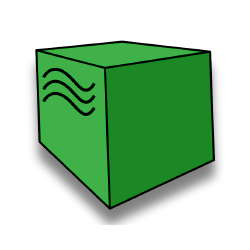
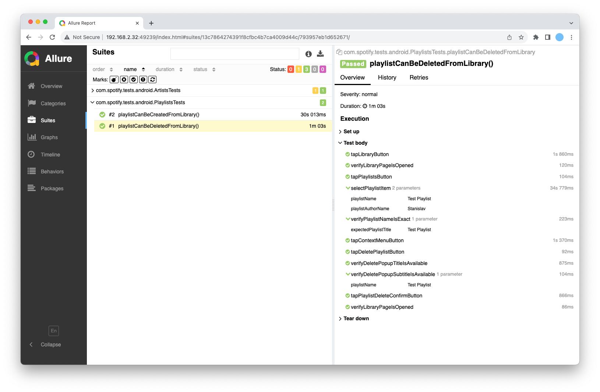
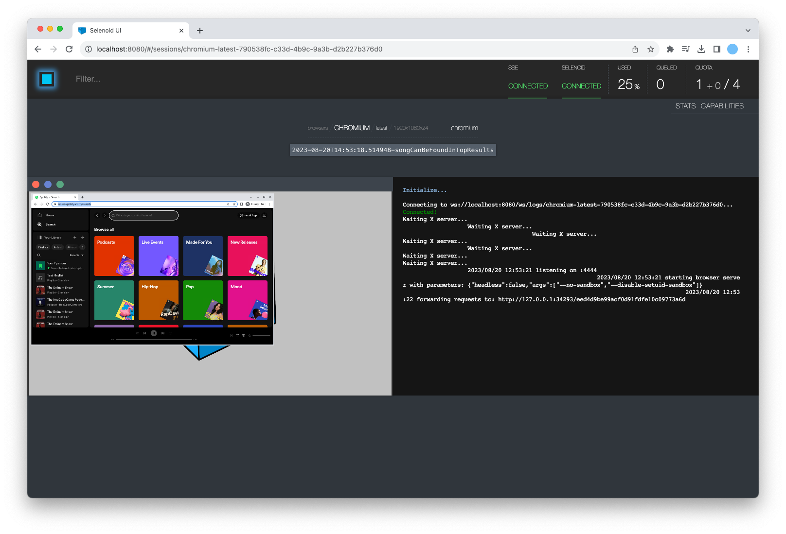
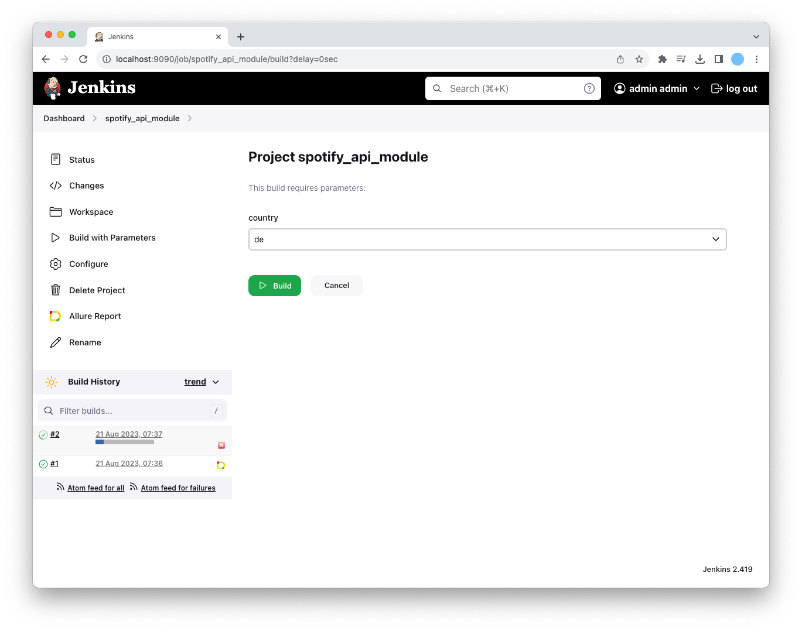

## Test automation project for Spotify app

<p align="center">
<br>
  
</p>

## Table of Contents
- [Overview](#overview)
- [Installation and Setup](#installation-and-setup)
- [Usage](#usage)
- [Disclaimer](#disclaimer)
- [License](#license)

## Overview
For this project I've used the latest public version of **Spotify app** and covered it with a few automation tests in **API**, **Mobile (Android)** and **Web** modules.

Whether you're looking for a **built-from-scratch** test automation project example, curious to see how **patterns** like Singleton, Page Object Model, Factory Method and Dependency Injection can be applied within the same scope or just wonder if **Spring Framework** might be useful in managing test components - this repository could be a great thing to explore and play around!

### Technology stack:

<p align="center">
<a href="https://appium.io/"></a><a href="https://www.docker.com/"></a><a href="https://github.com/allure-framework"></a><a href="https://gradle.org/"></a><a href="https://rest-assured.io/"></a><a href="https://www.java.com/en/"></a><a href="https://junit.org/junit5/"></a><a href="https://aerokube.com/moon/"></a><a href="https://spring.io/projects/spring-framework"></a><a href="https://playwright.dev/java/"></a><a href="https://www.jenkins.io/"></a>
</p>

### Showcase:

<p align="center">
<br>

<br>
<i>Automated Mobile test run</i>
</p>

<br>
<details>
  <summary>Click to see a test run example from the <b>Web</b> module</summary>
<p align="center">
<br>

<br>
<i>Automated Web test run</i>
</p>
</details>

<details>
  <summary>Click to see a test run example from the <b>API</b> module</summary>
<p align="center">
<br>

<br>
<i>Automated API test run</i>
</p>
</details>


### Reporting Results, Remote Run and Continuous Integration:
* You can generate a new Allure report for each test module:
<p align="center">

</p>

* Web tests can be launched remotely on a Moon instance:
<p align="center">

</p>

* All the tests are parametrised and are well suited for CI flow that you can maintain with Jenkins. Give it a try with a separate Freestlye Project per each module:
<p align="center">

</p>

## Installation and Setup
### General:
* Clone the repo to a local directory: <br>
  ```git clone https://github.com/gitstanhub/test-automation-experiment-spotify.git```

* A <a href="https://www.spotify.com/us/signup">Spotify account</a> signed up for the <a href="https://developer.spotify.com/">developers program</a> is required to generate access token for API tests and provide user credentials for Web and Mobile tests
* After creating a Spotify user, make sure to update your account Library with the Artist, Albums and Tracks from the test data properties or replace it with your own set
* For remote test runs and CI tasks you can roll out new Jenkins and Moon instances locally using <a href="https://www.docker.com/products/docker-desktop/">Docker</a>

### Mobile:
* An Android device is required to run Mobile tests - you can use a physical one, one emulated in <a href="https://developer.android.com/studio?gclid=CjwKCAjwloynBhBbEiwAGY25dFopnpw9Us70vSbwsxOIttDY1AWf62uCQdbWzUwp6jvWt-OSEgehVhoCFq0QAvD_BwE&gclsrc=aw.ds">Android Studio</a> or a remote one from <a href="https://www.browserstack.com/">Browserstack</a>
* For a test build you can use the latest public version of the <a href="https://play.google.com/store/apps/details?id=com.spotify.music&hl=en_GB">Spotify app</a> downloaded from Google Play
* Install <a href="https://appium.io/docs/en/2.1/quickstart/install/">Appium</a> and <a href="https://appium.io/docs/en/2.1/quickstart/uiauto2-driver/">UiAutomator2 Driver</a> before running mobile tests

## Usage
* To run a test with default parameters:<br>

```gradle :api:test```<br>

```gradle :mobile:test```<br>

```gradle :web:test```<br>

* To run a test while specifying exact parameter values:<br>

```gradle :api:test -Dcountry=de```<br>

```gradle :mobile:test -Dcountry=de -Denvironment=local -DplatformName=android -DdeviceName=pixel_4_emulated```<br>

```gradle :web:test -Dcountry=uk -Denvironment=remote -Dbrowser=chromium```<br>

## Disclaimer

This project is for educational purposes only and serves as a demonstration of test automation techniques. It is not affiliated with, endorsed by, or connected to Spotify. All Spotify logos, names, trademarks, and other proprietary materials are owned by Spotify or its affiliates.

## License

This project is open-source and is licensed under the MIT License. See [LICENSE](./LICENSE) for more information.
